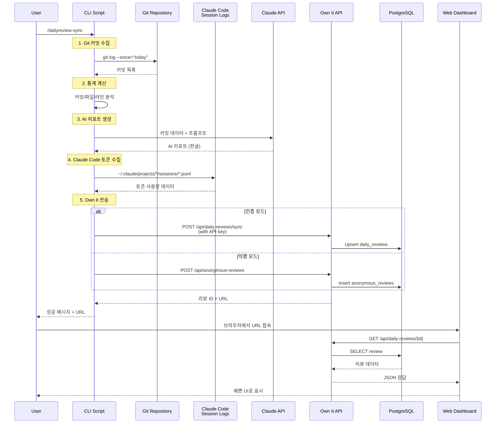

# 📊 Daily Review 사용 가이드

Own It과 연동하여 Git 커밋을 분석하고 AI 리포트를 생성하는 데일리 리뷰 시스템입니다.

## 📖 목차

- [기능 소개](#기능-소개)
- [사용자 플로우](#사용자-플로우)
- [설정 방법](#설정-방법)
- [사용 방법](#사용-방법)
- [기술 아키텍처](#기술-아키텍처)

---

## 🎯 기능 소개

### 핵심 기능

1. **Git 커밋 분석**: 오늘 작업한 커밋을 자동으로 수집 및 분석
2. **AI 리포트 생성**: Claude API를 활용한 한글 일일 리뷰 리포트
3. **토큰 사용량 추적**: Claude Code 세션에서 사용한 토큰 및 비용 계산
4. **Own It 연동**: 웹 대시보드에서 예쁜 UI로 확인 가능

### 수집 데이터

- **커밋 정보**: SHA, 시간, 메시지, 작성자, 파일 목록, 변경 라인 수
- **통계**: 총 커밋 수, 파일 수, 추가/삭제 라인 수
- **분석**: 주요 작업 영역, 파일별 변경 횟수
- **토큰**: Claude Code 사용 토큰 (input, output, cache creation, cache read)
- **AI 리포트**: 요약, 주요 성과, 기술적 하이라이트, 권장사항

---

## 👥 사용자 플로우

### 1️⃣ 익명 모드 (API 키 없이)


#### 특징
- API 키 없이 바로 사용 가능
- 24시간 후 자동 삭제
- 임시 URL로 공유 가능
- 로그인 없이 즉시 확인

#### 실행 예시

```bash
cd /path/to/your/project
/dailyreview-sync
```

출력:
```
📅 Daily Review - 2025-11-23
**3개 커밋 | 40개 파일 | +4726줄 -404줄**

🤖 AI 리포트 생성 중...
✅ AI 리포트 생성 완료
📊 토큰 사용: Input=1162, Output=473

🔍 Claude Code 토큰 사용량 수집 중...
✅ Claude Code 토큰: 42389503 (비용: $31.58)

🔄 Own It에 업로드 중... (익명 모드)
✅ 익명 리뷰 생성 완료!

━━━━━━━━━━━━━━━━━━━━━━━━━━━━━━━━━━━━━━━━━━━━━━━━━━━━
💡 웹에서 예쁘게 보고 싶으신가요?

브라우저에서 타임라인과 통계를 확인할 수 있습니다:
http://localhost:3000/reviews/{review-id}

⚠️  주의: 익명 리뷰는 24시간 후 자동 삭제됩니다
   만료 시간: 2025-11-24T10:09:00.883Z
━━━━━━━━━━━━━━━━━━━━━━━━━━━━━━━━━━━━━━━━━━━━━━━━━━━━

지금 브라우저에서 보시겠습니까? (Y/n)
```

---

### 2️⃣ 인증 모드 (API 키 사용)


#### 특징
- 사용자 계정에 영구 저장
- 히스토리 추적 가능
- 통계 및 트렌드 분석
- 여러 프로젝트 관리

#### 설정 순서

**1단계: Own It에서 API 키 발급**

```bash
# 브라우저에서 접속
http://localhost:3000

# GitHub로 로그인 후
# Settings > API Keys > Create New Key
```

**2단계: 설정 파일에 저장**

```bash
# ~/.claude-daily-commands/config.json 편집
{
  "claude_api_key": "sk-ant-api03-...",
  "ownit_api_key": "own_it_sk_..."
}
```

**3단계: 커맨드 실행**

```bash
cd /path/to/your/project
/dailyreview-sync
```

출력:
```
📅 Daily Review - 2025-11-23
**3개 커밋 | 40개 파일 | +4726줄 -404줄**

🤖 AI 리포트 생성 중...
✅ AI 리포트 생성 완료

🔍 Claude Code 토큰 사용량 수집 중...
✅ Claude Code 토큰: 42389503 (비용: $31.58)

🔄 Own It에 동기화 중... (인증 모드)
✅ Own It 동기화 완료!
📊 리뷰 확인: http://localhost:3000/daily/{review-id}
```

---

## ⚙️ 설정 방법

### 1. 초기 설치

```bash
# 설치 스크립트 실행
curl -fsSL https://raw.githubusercontent.com/wineny/claude-daily-commands/main/install.sh | bash

# 또는 저장소 클론
git clone https://github.com/wineny/claude-daily-commands.git
cd claude-daily-commands
bash install.sh
```

### 2. Claude API 키 설정 (AI 리포트용)

```bash
# config.json 생성/편집
{
  "claude_api_key": "sk-ant-api03-YOUR_KEY_HERE"
}
```

> **참고**: AI 리포트 생성은 선택사항입니다. API 키가 없어도 기본 통계는 수집됩니다.

### 3. Own It API 키 설정 (인증 모드용)

```bash
# 1. Own It에 로그인
http://localhost:3000

# 2. API 키 발급
Settings > API Keys > Create New Key

# 3. config.json에 추가
{
  "claude_api_key": "sk-ant-api03-...",
  "ownit_api_key": "own_it_sk_..."
}
```

---

## 💻 사용 방법

### 기본 사용

```bash
# 프로젝트 디렉토리로 이동
cd /path/to/your/project

# 데일리 리뷰 생성
/dailyreview-sync
```

### 옵션

```bash
# 특정 날짜의 리뷰 생성
/dailyreview-sync --date 2025-11-22

# Own It 동기화 비활성화 (로컬만)
/dailyreview-sync --no-sync
```

### 자동화 (선택사항)

```bash
# cron으로 매일 저녁 6시 실행
0 18 * * * cd /path/to/project && /dailyreview-sync
```

---

## 🏗️ 기술 아키텍처

### 전체 플로우



### 데이터 구조

#### CLI → API 전송 데이터

```json
{
  "date": "2025-11-23",
  "repository": {
    "path": "/Users/user/project",
    "remote": "https://github.com/user/repo.git"
  },
  "stats": {
    "commits": 3,
    "files": 40,
    "additions": 4726,
    "deletions": 404
  },
  "commits": [
    {
      "sha": "abc123...",
      "time": "2025-11-23 18:05:41 +0900",
      "message": "feat: Add feature",
      "author": "Username",
      "files": ["file1.ts", "file2.ts"],
      "additions": 100,
      "deletions": 20
    }
  ],
  "analysis": {
    "mainAreas": ["apps", "root"],
    "fileChanges": {
      "apps/api/src/index.ts": 3,
      "apps/web/components/ui.tsx": 2
    }
  },
  "aiReport": "# 📊 일일 개발 리뷰\n\n...",
  "claudeCodeUsage": {
    "input": 2189,
    "output": 54898,
    "cacheCreation": 4973127,
    "cacheRead": 36778044,
    "total": 41808258,
    "costUsd": 30.5127
  }
}
```

#### 데이터베이스 스키마

**daily_reviews 테이블** (인증 모드)
```sql
CREATE TABLE daily_reviews (
  id UUID PRIMARY KEY,
  user_id UUID NOT NULL REFERENCES users(id),
  repository_id UUID REFERENCES github_repositories(id),
  review_date DATE NOT NULL,

  -- Git 통계
  total_commits INTEGER,
  total_files INTEGER,
  lines_added INTEGER,
  lines_deleted INTEGER,

  -- 상세 데이터
  commits JSONB,
  main_work_areas TEXT[],
  file_changes JSONB,

  -- 저장소 정보
  repository_path TEXT,
  repository_remote TEXT,

  -- AI 리포트
  ai_report TEXT,
  ai_report_generated_at TIMESTAMP,

  -- 토큰 사용량
  tokens_input INTEGER,
  tokens_output INTEGER,
  tokens_cache_creation INTEGER,
  tokens_cache_read INTEGER,
  tokens_total INTEGER,
  cost_usd NUMERIC(10, 4),

  -- 메타 데이터
  created_at TIMESTAMP DEFAULT NOW(),
  updated_at TIMESTAMP DEFAULT NOW(),

  UNIQUE(user_id, review_date, repository_id)
);
```

**anonymous_reviews 테이블** (익명 모드)
```sql
CREATE TABLE anonymous_reviews (
  id UUID PRIMARY KEY,
  review_date DATE NOT NULL,

  -- 동일한 필드 구조
  -- ... (daily_reviews와 동일)

  -- 익명 전용 필드
  expires_at TIMESTAMP NOT NULL,
  view_count INTEGER DEFAULT 0,
  converted_to_user_id UUID REFERENCES users(id),

  created_at TIMESTAMP DEFAULT NOW()
);
```

### 컴포넌트 설명

#### 1. CLI 스크립트 (`sync-daily-review.sh`)

**역할**: Git 데이터 수집, AI 리포트 생성, Own It 전송

**주요 로직**:
- Git 커밋 수집: `git log --since="today 00:00"`
- 통계 계산: 커밋/파일/라인 집계
- AI 리포트: Claude API 호출 (한글 프롬프트)
- Claude Code 토큰: `~/.claude/projects/*/sessions/*.jsonl` 파싱
- Own It 전송: 인증/익명 모드 자동 선택

#### 2. Backend API

**daily-reviews.service.ts**
- `upsertDailyReview()`: 리뷰 생성/업데이트 (Upsert)
- `getDailyReviews()`: 리뷰 목록 조회 (페이지네이션)
- `getDailyReview()`: 단일 리뷰 조회
- `getDailyReviewByDate()`: 날짜로 리뷰 조회

**anonymous-reviews.controller.ts**
- `createAnonymousReview()`: 익명 리뷰 생성 (24시간 유효)
- `getAnonymousReview()`: 익명 리뷰 조회
- `convertAnonymousReview()`: 익명 → 사용자 리뷰 변환

#### 3. 토큰 우선순위 로직

```typescript
// Claude Code 토큰 > AI 리포트 토큰
if (input.claudeCodeUsage) {
  totalTokens = input.claudeCodeUsage.total;
  totalCost = input.claudeCodeUsage.costUsd;
} else if (input.tokenUsage) {
  totalTokens = input.tokenUsage.total;
  totalCost = input.cost?.usd;
}
```

**이유**: Claude Code 세션 토큰이 실제 개발 비용이므로 우선

---

## 🔍 트러블슈팅

### AI 리포트가 생성되지 않아요

**원인**: Claude API 키가 없거나 잘못됨

**해결**:
```bash
# config.json 확인
cat ~/.claude-daily-commands/config.json

# claude_api_key 확인
# Anthropic Console에서 새 키 발급: https://console.anthropic.com/
```

### 익명 모드로만 동작해요

**원인**: Own It API 키가 설정되지 않음

**해결**:
```bash
# 1. Own It 로그인
# 2. API 키 발급
# 3. config.json에 추가
{
  "ownit_api_key": "own_it_sk_..."
}
```

### 토큰 사용량이 0으로 나와요

**원인**: 오늘 Claude Code를 사용하지 않음

**확인**:
```bash
# Claude Code 세션 로그 확인
ls ~/.claude/projects/*/sessions/*.jsonl

# 오늘 날짜의 로그가 있는지 확인
grep "2025-11-23" ~/.claude/projects/*/sessions/*.jsonl
```

### URL이 작동하지 않아요

**원인**: API 서버가 실행 중이 아님

**해결**:
```bash
# API 서버 시작
cd /path/to/own-it/apps/api
pnpm dev

# 확인
curl http://localhost:4000/health
```

---

---

## 🔧 알려진 이슈 및 개선 사항

### 자동 업데이트 미작동

**현재 상태**:
- 수동 업데이트 스크립트(`update.sh`)는 존재하지만 데일리 리뷰 실행 시 자동으로 체크되지 않음
- 사용자가 새 기능이나 버그 수정을 받으려면 수동으로 업데이트 스크립트를 실행해야 함

**수동 업데이트 방법**:
```bash
# 옵션 1: 저장소 디렉토리에서
cd ~/claude-daily-commands  # 또는 ~/development/claude-daily-commands
./scripts/update.sh

# 옵션 2: 어디서든 재설치
curl -fsSL https://raw.githubusercontent.com/wineny/claude-daily-commands/main/install.sh | bash
```

**개선 필요 사항**:
- `/dailyreview-sync` 실행 시 자동으로 업데이트 체크
- 백그라운드에서 새 버전 확인 후 사용자에게 알림
- 옵션으로 자동 업데이트 활성화/비활성화

**예상 개선 플로우**:
```bash
# 데일리 리뷰 실행 시
/dailyreview-sync

# 출력:
# 🔍 업데이트 확인 중...
# 📦 새 버전 사용 가능: v1.2.0 → v1.3.0
#   ✓ feat: AI 리포트 한글 지원
#   ✓ fix: 토큰 수집 성능 개선
#
# 지금 업데이트하시겠습니까? (Y/n)
```

**Workaround (임시 해결책)**:
정기적으로 수동 업데이트 실행을 권장합니다:
```bash
# 매주 월요일 오전 9시 자동 업데이트 체크 (cron)
0 9 * * 1 cd ~/claude-daily-commands && ./scripts/update.sh --check-only
```

---

## 📚 참고 자료

- [Own It GitHub](https://github.com/InjunH/own-it)
- [Claude Daily Commands](https://github.com/wineny/claude-daily-commands)
- [Claude API Docs](https://docs.anthropic.com/)
- [Claude Code 토큰 가격](https://www.anthropic.com/pricing)
